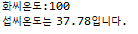

### 화씨를 섭씨로 변환하는 코드

```java
class  {
    public static void main(String[] args) {
        int fah= 100;
        float cel = (int)(5/9f*(fah-32)*100+0.5)/100f;

        System.out.println("화씨온도:"+fah);
        System.out.println("섭씨온도는 "+cel+ "입니다.");
    }
}
```


헷갈려서 기록해둠!.

0.5를 왜 더하는지 몰랐다. 그래서 이곳저곳 찾아봄.. 

셋째자리 반올림을 하기위해서 100을 곱하고 0.5를 더하여 반올림 처리하기 위함이다.

그 뒤 수식은 다시 소수점을 원래대로 돌리기 위함이다.


출력화면



